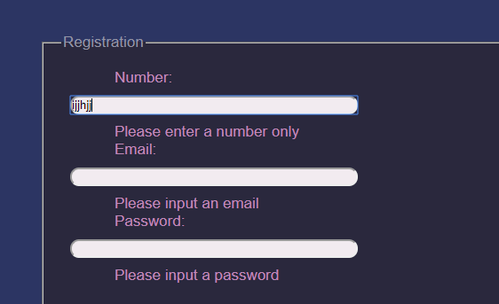
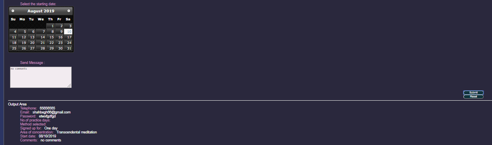

# js-validation-form

## A jquery-validation form for the "A Higher State" website contact page.

### Validates various fields like -
1)Empty/required fields

2)Distintion between numbers and alphabet field

3)Valid email

4)minimum character for password

### Once all the fields go through the validation, the output is stored in a string variable line-by-line and is displayed in the outpu field-

